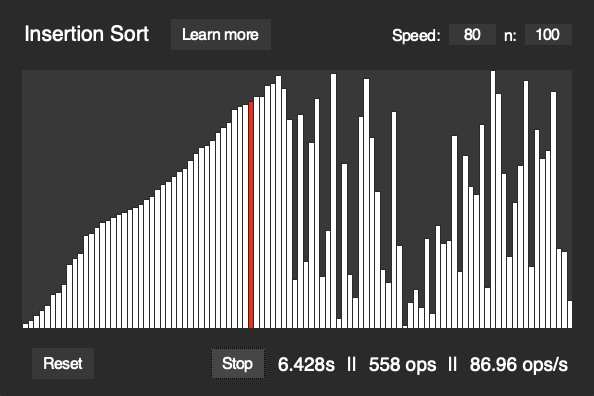
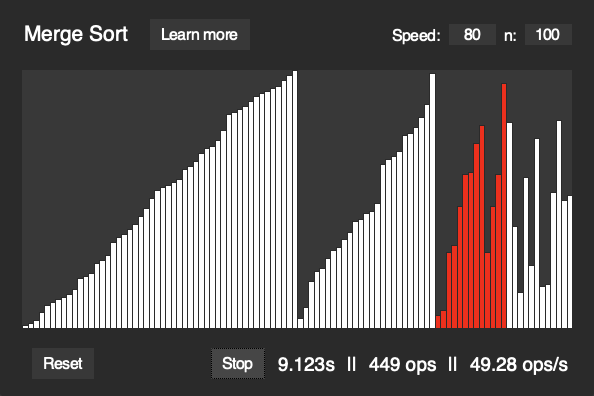

  

# Algorithm Visualizer

**Algorithm Visualizer** is a long-term Python project aimed at practicing the implementation of different algorithms, visualizing them, and learning about their efficiency.

More algorithms will be gradually added over time.

## Features

- **Algorithm selection** menu
- Several algorithms can be run at the same time
- You can:
  - Read an **explanation** of the algorithm
  - **Time** each algorithm
  - Count the **number of operations**
  - Change the **number of items** in the set
  - Change the **speed** of the algorithm
  

## Included Algorithms
- **Sorting Algorithms**:
  - Merge Sort
  - Quick Sort
  - Insertion Sort
  - Selection Sort
  - Bubble Sort

  ## Screenshots

  
  

## Future Features

At the moment, there are no plans to introduce any new features other than new algorithms.

## Requirements

**Python** must be installed on your machine to run the project. In the future, I may create a .exe and a .dmg so you can run it without needing Python.

Make sure to use the **latest Tk version** to run the program or you **might get a blank screen** and warning in the terminal.

## License

This project is licensed under the MIT License.

#

**Algorithm Visualizer** is an open-source project developed by Javier Iregui, 2025.
