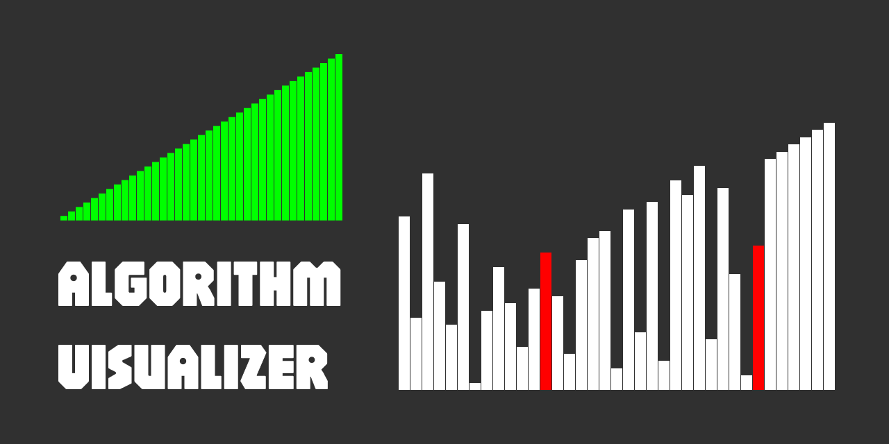

  

# Algorithm Visualizer

**Algorithm Visualizer** is a Python app that allows... .

## Features

- Included **algorithm**:
    - fdfdsf

## Future Features

At the moment, there are no plans to introduce any new features.

## Requirements

## Build Instructions

## License

This project is licensed under the MIT License.

#

**Algorithm Visualizer** is an open-source project developed by Javier Iregui, 2025.
